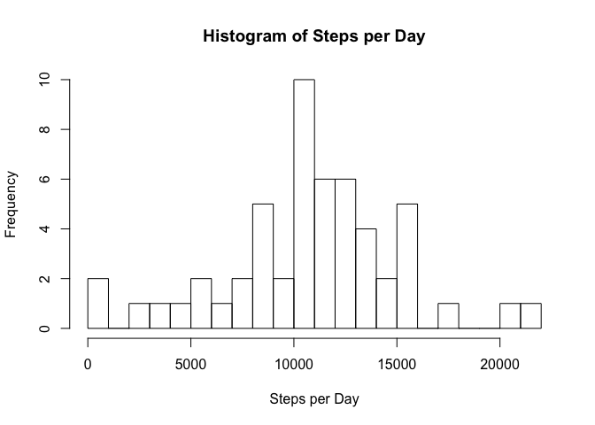
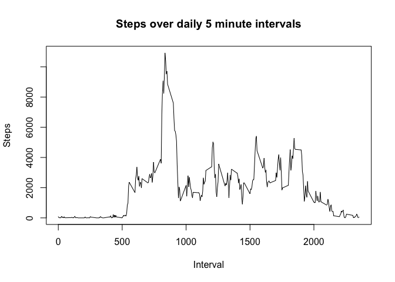
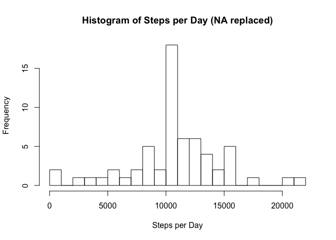
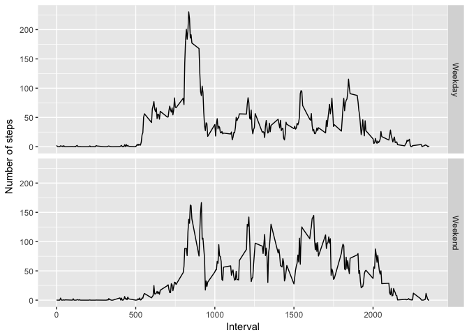

###What is mean total number of steps taken per day?


```r
data<-read.csv("activity.csv")
stepsPerDay<-aggregate(steps~date,data,sum)
hist(stepsPerDay$steps,breaks=20,xlab = "Steps per Day", main = "Histogram of Steps per Day")
```

<!-- -->


```r
library(knitr)
library(kableExtra)
stats<-data.frame(c("Mean","Median","Total"),c(mean(stepsPerDay$steps),median(stepsPerDay$steps),sum(stepsPerDay$steps)))
colnames(stats)<-c('stat','steps')
stats$steps<-round(stats$steps,0)
kable(stats, "html") %>%
  kable_styling(bootstrap_options = "striped", full_width = F, position = "left")
```

<table class="table table-striped" style="width: auto !important; ">
 <thead>
  <tr>
   <th style="text-align:left;"> stat </th>
   <th style="text-align:right;"> steps </th>
  </tr>
 </thead>
<tbody>
  <tr>
   <td style="text-align:left;"> Mean </td>
   <td style="text-align:right;"> 10766 </td>
  </tr>
  <tr>
   <td style="text-align:left;"> Median </td>
   <td style="text-align:right;"> 10765 </td>
  </tr>
  <tr>
   <td style="text-align:left;"> Total </td>
   <td style="text-align:right;"> 570608 </td>
  </tr>
</tbody>
</table>

###What is the average daily activity pattern?


```r
intervals<-aggregate(steps~interval,data,sum)
plot(intervals$interval,intervals$steps,type='l',xlab = 'Interval',ylab = 'Steps',main = 'Steps over daily 5 minute intervals')
```

<!-- -->

```r
m<-intervals[which.max(intervals$steps),]
```

The interval with the maximum number of steps is 835


###Imputing missing values

```r
naCountSteps<-sum(is.na(data$steps))
```
There are 2304 intervals with missing step values.


```r
averages<-aggregate(steps~interval,data,mean,na.remove=TRUE)
replace_na<-function(step,interval){
  if(is.na(step))
    return(averages[averages$interval == interval, "steps"])
  return(step)
}
data_without_na<-data
data_without_na$steps <- mapply(replace_na, data_without_na$steps, data_without_na$interval)
stepsPerDay<-aggregate(steps~date,data_without_na,sum)
hist(stepsPerDay$steps,breaks=20,xlab = "Steps per Day", main = "Histogram of Steps per Day (NA replaced)")
```

<!-- -->


```r
stats<-data.frame(c("Mean","Median"),c(mean(stepsPerDay$steps),median(stepsPerDay$steps)))
colnames(stats)<-c('','')
kable(stats, "html") %>%
  kable_styling(full_width = F, position = "left")
```

<table class="table" style="width: auto !important; ">
 <thead>
  <tr>
   <th style="text-align:left;">  </th>
   <th style="text-align:right;">  </th>
  </tr>
 </thead>
<tbody>
  <tr>
   <td style="text-align:left;"> Mean </td>
   <td style="text-align:right;"> 10766.19 </td>
  </tr>
  <tr>
   <td style="text-align:left;"> Median </td>
   <td style="text-align:right;"> 10766.19 </td>
  </tr>
</tbody>
</table>

###Are there differences in activity patterns between weekdays and weekends?


```r
weekday <- function(date) {
  date<-as.Date(date)
  day<-weekdays(as.Date(date))
  if(day %in% c('Saturday','Sunday'))
    return('Weekend')
  return('Weekday')
}
data_without_na$day <- sapply(data_without_na$date, FUN = weekday)
averages <- aggregate(steps ~ interval + day, data = data_without_na, mean)
library(ggplot2)
ggplot(averages, aes(interval, steps)) + geom_line() + facet_grid(day ~ .) + 
    xlab("Interval") + ylab("Number of steps")
```

<!-- -->
